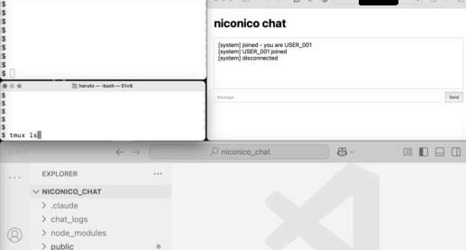

# NicoNico-Style LAN Chat

A real-time LAN chat system with anonymous USER IDs, CSV logging, and niconico-style scrolling message display.

## Objective

This system is designed to **encourage anonymous questions during live meetings and presentations**, especially for questions to hesitate to ask publicly.

**Use cases:**
- **"What is...?" questions** - Ask for definitions of technical terms to remind yourself
- **Clarification requests** - "Can you repeat that?" or "What did you mean by...?"
- **Basic questions** - Questions that might seem "too simple" to ask aloud
- **Real-time feedback** - Quick questions during lectures without interrupting the speaker

**Why it works:**
- **Anonymous USER IDs** (`USER_001`, `USER_002`) remove social pressure and fear of judgment
- **Scrolling display** makes questions visible to presenters without disrupting the flow
- **LAN-based** keeps questions within the meeting room (no public internet exposure)
- **Low barrier** - Just open a browser, enter room code, and ask

**Example scenario:**
During a biology presentation, a student types "What is mitochondria?" and it scrolls across the display. The presenter can address it without the student feeling embarrassed about asking a "basic" question.

## Demo



sorry for the gray color

---

## Quick Start

### 1. Setup (One-time)
#### git clone
```bash
git clone https://github.com/iharuto/niconico_chat.git
cd niconico_chat
```

#### Install Node.js Dependencies
```bash
npm install
```

#### Install Python Dependencies
```bash
pip install -r requirements.txt
```

#### Install tmux (if not already installed)
```bash
brew install tmux
```

#### Set Room Code (Recommended for Security)
Create a `.ROOM_CODE.txt` file to keep your room code secret:

```bash
echo "YOUR_SECRET_CODE" > .ROOM_CODE.txt
```

This prevents the room code from:
- Appearing in terminal output
- Being saved in shell history
- Being visible to anyone looking at your screen

**Note:** `.ROOM_CODE.txt` is already in `.gitignore` and won't be committed to git.

That's it! No additional packages needed.

---

### 2. How to Run

#### Recommended: Single Command Startup

The easiest way to start the chat system is using the `main.sh` script:

```bash
cd niconico_chat
./main.sh
```

You should see:
```
[main] server started in tmux session: lan_chat
[main] PORT=3000  MAX_CLIENTS=30

Access URL:
  http://YOUR.WIFI.IP.ADDRESS:3000

Press Ctrl+C to stop (this will also stop server/client).
```

- Starts server and display client automatically in background (tmux)
- Auto-detects your WiFi IP address
- Shows access URL for easy sharing

# Or override with environment variables
```bash
MAX_CLIENTS=10 PORT=8080 MAX_CONNECTIONS_PER_IP=2 ./main.sh
```

- `MAX_CLIENTS` - Maximum number of participants allowed (default: 30)
- `PORT` - Port number for server (default: 3000)
- `MAX_CONNECTIONS_PER_IP` - Maximum connections per IP address (default: 1)


### chr_flow Display Settings (**optional**)

Edit `chr_flow.py` to customize the display:

```python
NUM_LANES = 5          # Max simultaneous messages (1-10)
LANE_HEIGHT = 80       # Vertical spacing (pixels)
LANE_START_Y = 150     # Top margin (pixels)
SPEED = 6              # Scroll speed (pixels/frame)
ALPHA = 0.9            # Window transparency (0.0-1.0)
```

**Recommendations:**
- **Busy chats**: Increase `NUM_LANES = 7` and `SPEED = 8`
- **Slow chats**: Decrease `NUM_LANES = 3` and `SPEED = 4`
- **More visible**: Increase `ALPHA = 1.0` (fully opaque)

---

## File Structure

```
niconico_chat/
├── main.sh                         # Single-command startup script
├── server.js                       # WebSocket server (Node.js)
├── public/
│   └── index.html                  # Web client (HTML/JS)
├── chat_logs/                      # CSV log files (auto-created)
│   ├── 20251231_132229_log.csv
│   └── 20251231_140530_log.csv
├── .IP_tmp_logs/                   # IP tracking logs (temp, auto-deleted)
│   ├── 20251231_132229_ip.log
│   └── 20251231_140530_ip.log
├── chr_flow.py                     # Display engine (PyObjC)
├── chat_display_client.py          # CSV watcher + display
├── requirements.txt                # Python dependencies
├── package.json                    # Node.js dependencies
└── README.md                       # This file
```

### IP Tracking Logs (Temporary)

**Purpose**: Rate limiting to prevent abuse (prevents one person from connecting multiple times).

**Configuration**:
- `MAX_CONNECTIONS_PER_IP` - Maximum connections allowed per IP address (default: 1)
- Set via environment variable: `MAX_CONNECTIONS_PER_IP=2 ./main.sh`

**Storage Details**:
- **Location**: `.IP_tmp_logs/` directory
- **Filename**: `YYYYMMDD_HHMMSS_ip.log` (same timestamp as corresponding chat log)
- **Format**: `IP_ADDRESS,CONNECTION_COUNT` (one per line)
- **Lifecycle**:
  - Created automatically on server start
  - Updated in real-time as users connect/disconnect
  - **Deleted automatically** on server stop (Ctrl+C)

**File content example** (`.IP_tmp_logs/20251231_132229_ip.log`):
```
192.168.1.100,1
192.168.1.101,2
192.168.1.102,1
```

**Timestamp correlation**:
Both chat logs and IP logs use the same timestamp for easy correlation:
```
chat_logs/20251231_132229_log.csv     # Chat messages
.IP_tmp_logs/20251231_132229_ip.log   # IP tracking (same timestamp!)
```

This allows the host to correlate chat activity with IP addresses if needed for moderation.

**Note**: IP logs are temporary and automatically cleaned up. They are NOT committed to git (listed in `.gitignore`).

---

## Troubleshooting

### Issue: chr_flow display not visible

**Checklist:**
1. Screen recording permission granted?
   - System Preferences > Security & Privacy > Privacy > Screen Recording
   - Enable for Terminal or Python
2. Display shows on correct screen? Or not full screen?
3. Window transparency too high? Edit `chr_flow.py`:
   ```python
   ALPHA = 1.0  # Fully opaque (easier to see)
   ```

**Find your server IP:**
```bash
# macOS
ifconfig | grep "inet " | grep -v 127.0.0.1

# Example output: inet 123.456.7.890
# Use: http://123.456.7.890:3000 from other devices
```

---

## Security & Privacy Considerations

### What Can the Host See?

**Important: Anonymity is only between participants, NOT from the host.**

The person running the server (host) has access to:

1. **Real nicknames** - Stored in CSV logs (`chat_logs/*.csv`)
   - Format: `time,nickname,user_id,text`
   - Host can see which USER_### corresponds to which nickname

2. **All messages** - Both in real-time and permanently in logs

3. **User IP addresses** - Available in WebSocket connection object (see below)

4. **Complete conversation history** - CSV files are never deleted automatically

**Example CSV entry:**
```csv
"13:23:08","Alice","USER_001","What is mitochondria?"
```
The host can see that "Alice" asked this question, even though other participants only see "USER_001".

### Can the Host See IP Addresses?

**YES** - IP addresses ARE logged for rate limiting purposes.

**Current implementation:**
The system now tracks IP addresses to prevent abuse (one person connecting multiple times):

**What's tracked** (server.js:155-157):
```javascript
wss.on("connection", (ws, req) => {
  // Extract and store client IP
  ws.clientIP = getClientIP(req);
```

**Where it's stored**:
- **Temporary log files**: `.IP_tmp_logs/YYYYMMDD_HHMMSS_ip.log`
- **Format**: `IP_ADDRESS,CONNECTION_COUNT` (one per line)
- **Lifecycle**: Created on server start, **automatically deleted on server stop**

**What this means:**
- ✅ **IP tracking enabled**: Host can see IP addresses during session
- ✅ **Temporary storage**: IP logs are deleted when server stops (Ctrl+C)
- ✅ **Rate limiting**: Prevents spam by limiting connections per IP
- ⚠️ **Host can correlate**: Host can link IP addresses to USER_### IDs and nicknames

**Example correlation:**
```csv
# chat_logs/20251231_132229_log.csv
"13:23:08","Alice","USER_001","What is mitochondria?"

# .IP_tmp_logs/20251231_132229_ip.log
192.168.1.100,1
```
The host can see that USER_001 (Alice) connected from IP 192.168.1.100.

**How to verify IP logging:**
- Check `server.js` lines 155-157 for `ws.clientIP = getClientIP(req)`
- Check for `.IP_tmp_logs/` directory during server runtime
- IP logs are visible while server runs, deleted on shutdown

### Trust Model

**This system requires trust in the host.** Only use it when:
- ✅ The host is trustworthy (e.g., your teacher, meeting organizer)
- ✅ You're comfortable with the host knowing your real nickname
- ✅ The host commits to keeping CSV logs confidential
- ✅ You're in a LAN environment you trust

**Do NOT use if:**
- ❌ You don't trust the host to keep identities confidential
- ❌ You need true anonymity (consider other platforms)
- ❌ The network is untrusted or public

### Network Security

**Transmission:**
- Messages sent in **plaintext** over LAN (no encryption)
- Room code transmitted **unencrypted**
- Anyone on the same LAN network with packet sniffing tools can read messages

**LAN-only design:**
- Intended for **local network use only** (classrooms, meeting rooms)
- **Do NOT expose to the internet** without:
  - HTTPS/WSS encryption (requires SSL certificates)
  - Proper authentication system
  - Rate limiting and DDoS protection
  - Security auditing

### Security Features

This system includes several security features to protect room codes:

1. **Password-masked input** - Room code field shows `***` instead of plain text when typing
2. **Hidden terminal output** - `main.sh` displays `ROOM_CODE=*****` instead of actual code
3. **ROOM_CODE.txt file** - Store room code in file (gitignored) instead of command line
4. **No shell history** - Using file prevents code from appearing in bash history

**Example of secure setup:**
```bash
# Create secret room code file (one time)
echo "MY_SECRET_CODE_2025" > ROOM_CODE.txt

# Start server (code won't appear in terminal or history)
./main.sh

# Output shows:
# [main] ROOM_CODE=*****  PORT=3000  MAX_CLIENTS=30
```

### Privacy Best Practices

**For hosts:**
1. **Use ROOM_CODE.txt** - Don't type room code in terminal where others can see
2. **Keep CSV logs confidential** - Don't share them publicly
3. **Delete logs after use** - Run `rm -rf chat_logs/ .IP_tmp_logs/` when done
   - Note: IP logs are auto-deleted on server stop, but CSV logs are permanent
4. **Inform participants** - Let them know you can see real nicknames and IP addresses
5. **Secure your computer** - CSV logs and IP logs contain private information

**For participants:**
1. **Trust the host** - They will see your real nickname and IP address
2. **Use appropriate nicknames** - Avoid using full real names if concerned
3. **Use trusted networks only** - Avoid public WiFi (IP address is logged)
4. **Know that anonymity is limited** - Host has full access to your identity and IP
5. **Check for shoulder surfers** - Room code is still visible as `***` while typing

### Recommended Use Cases

**✅ Appropriate:**
- Classroom lectures with trusted teacher as host
- Company meetings with IT department as host
- Conference presentations with organizer as host
- Study groups among friends

**❌ Not appropriate:**
- Public internet deployment
- Untrusted hosts
- High-security environments
- Anonymous whistleblowing (use proper anonymous platforms instead)

### What the Host Cannot Do

- **Cannot modify past messages** - CSV is append-only during session
- **Cannot see messages before server starts** - No history from previous sessions unless CSV files are kept
- **Cannot identify users who only observe** - Must send a message to be logged

### Additional Security Notes

- **IP-based rate limiting enabled**: Limits connections per IP address (default: 1 per IP)
- **IP logging active**: Temporary logs stored in `.IP_tmp_logs/` during session
- No authentication beyond room code (simple shared password)
- CSV files stored unencrypted on host's disk (permanent)
- IP log files stored unencrypted on host's disk (temporary - auto-deleted)
- No automatic CSV log rotation or deletion
- Display client is read-only (cannot send messages)

**Bottom line:** This is a **privacy-lite** system designed for trusted LAN environments like classrooms. It provides anonymity between participants but requires complete trust in the host.

---

## Technical Details

### Technologies Used

**Server:**
- Node.js + Express (HTTP server)
- ws library (WebSocket server)
- Built-in fs, path (File I/O)

**Client:**
- Vanilla HTML/JavaScript (no frameworks)
- WebSocket API (built-in)

**Display:**
- Python 3 (standard library only)
- PyObjC (macOS native UI)
- csv, glob, os, threading (built-in modules)

### Security Considerations

**Room Codes:**
- Transmitted in plaintext (use HTTPS for production)
- No rate limiting (LAN usage assumed safe)
- No password hashing (simple authentication)

**CSV Logs:**
- Contain real nicknames (private information)
- Stored unencrypted on disk
- Add `chat_logs/*.csv` to `.gitignore`

**Display Client:**
- Read-only (doesn't send messages)
- Requires file system access
- Runs with user privileges

### Performance

**Server:**
- Handles ~100 concurrent connections easily
- CPU: <5% on modern hardware
- Memory: ~50MB base + 1MB per connection

**Display Client:**
- CPU: <2% (polling overhead)
- Memory: ~100MB (PyObjC + chr_flow)
- Disk I/O: <1KB/s (CSV reads)

**Suitable for:**
- Small to medium LAN events (5-50 people)
- Local development/testing
- Personal/home use

**Not suitable for:**
- Large public servers (>100 users)
- Internet-facing deployments (no TLS/auth)
- High-security environments

---

## Credits & Inspiration

This project is inspired by the scrolling comment (danmaku) style popularized by **niconico douga (niconico動画)**.

This implementation is original and not affiliated with or endorsed by DWANGO or niconico douga.

**Key differences:**
- LAN-only (not internet-facing)
- CSV-based (simpler architecture)
- Anonymous USER IDs (privacy-focused)
- macOS native display (PyObjC)

---

## License

See LICENSE file for details.

